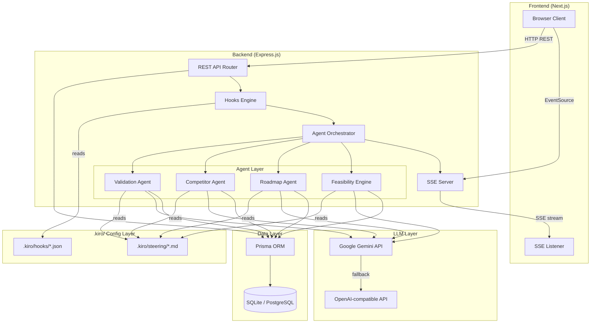
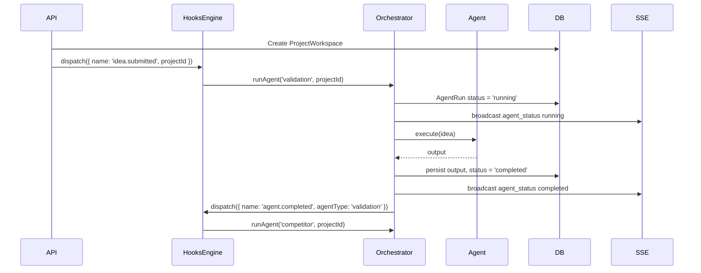
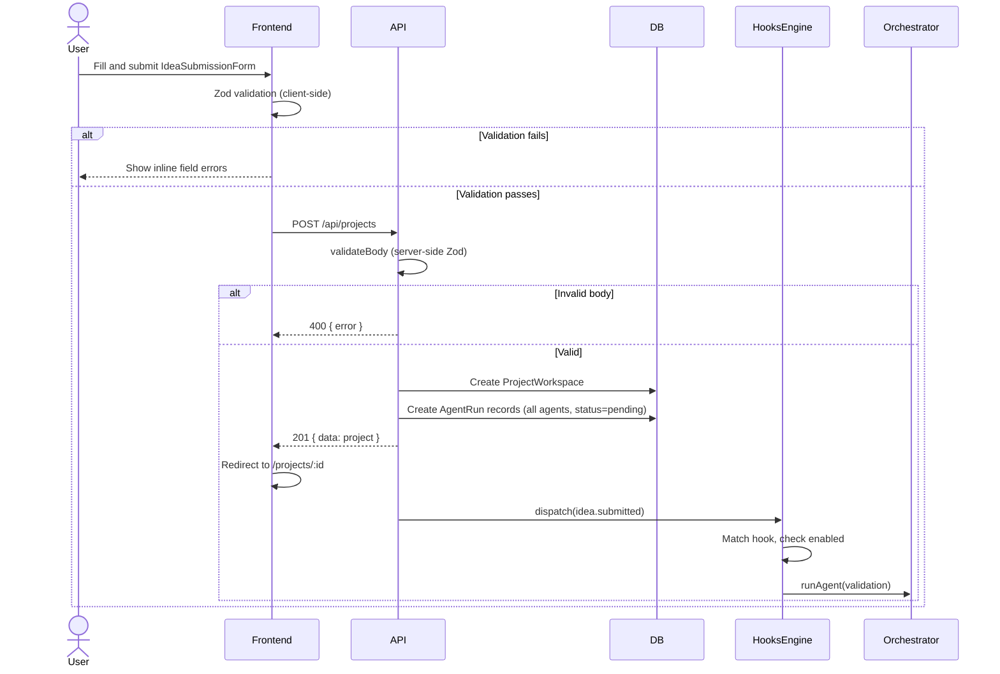
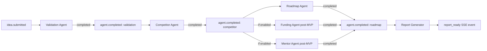
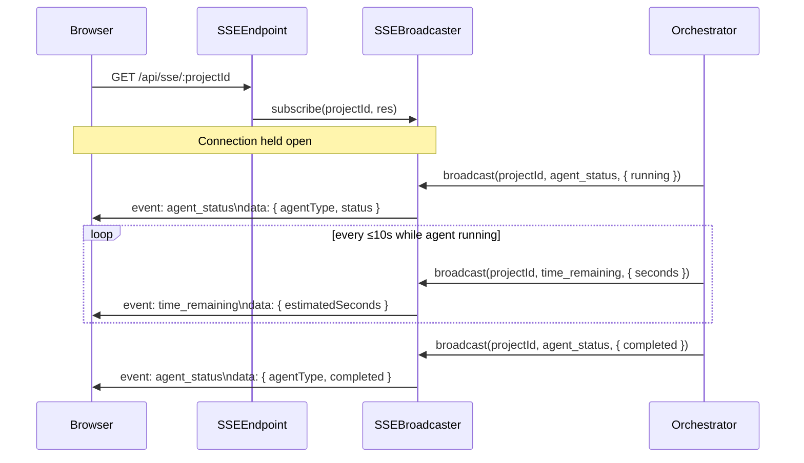

# Design Document: InnovationOS

## Overview

InnovationOS is a production-ready, spec-driven, agentic AI platform that transforms raw startup ideas into comprehensive, validated startup plans through a coordinated pipeline of specialized AI agents. The platform orchestrates sequential and parallel agent execution, persists structured outputs in a relational database, and delivers a Startup Intelligence Report — all surfaced through a real-time, accessible web dashboard.

The architecture follows a monorepo structure with three logical layers:
- **Frontend** — Next.js + TypeScript + Tailwind CSS + ShadCN UI
- **Backend** — Node.js + Express.js with a Hooks-driven orchestration engine
- **Database** — Prisma ORM over SQLite (dev) / PostgreSQL (prod)

Kiro Steering Files define core agent behavior principles (student-first, ethical AI, explainability) and are injected as LLM system context at every agent invocation. Kiro Hooks, defined as declarative JSON configs in `.kiro/hooks/`, drive the agent execution pipeline without hardcoded sequencing logic.

---

## Architecture

### High-Level System Diagram



### Monorepo Structure

```
innovation-os/
├── packages/
│   ├── frontend/                    # Next.js app
│   │   ├── src/
│   │   │   ├── app/                 # Next.js App Router pages
│   │   │   │   ├── page.tsx         # Landing / idea submission
│   │   │   │   ├── projects/
│   │   │   │   │   ├── page.tsx     # Project list
│   │   │   │   │   └── [id]/
│   │   │   │   │       └── page.tsx # Project workspace dashboard
│   │   │   ├── components/
│   │   │   │   ├── forms/
│   │   │   │   │   └── IdeaSubmissionForm.tsx
│   │   │   │   ├── dashboard/
│   │   │   │   │   ├── ProjectWorkspaceDashboard.tsx
│   │   │   │   │   ├── AgentStatusPanel.tsx
│   │   │   │   │   ├── ScoreCard.tsx
│   │   │   │   │   ├── RoadmapTimeline.tsx
│   │   │   │   │   ├── CompetitorTable.tsx
│   │   │   │   │   ├── FeasibilityPanel.tsx
│   │   │   │   │   └── ReportViewer.tsx
│   │   │   │   └── ui/              # ShadCN primitives
│   │   │   ├── hooks/               # React hooks
│   │   │   │   ├── useSSE.ts
│   │   │   │   └── useProjectStore.ts
│   │   │   ├── lib/
│   │   │   │   ├── api.ts           # API client
│   │   │   │   └── utils.ts
│   │   │   └── types/               # Re-exports from shared
│   │   ├── public/
│   │   ├── tailwind.config.ts
│   │   ├── next.config.mjs
│   │   └── package.json
│   │
│   ├── backend/                     # Express.js server
│   │   ├── src/
│   │   │   ├── server.ts            # Entry point
│   │   │   ├── routes/
│   │   │   │   ├── projects.ts
│   │   │   │   ├── agents.ts
│   │   │   │   ├── reports.ts
│   │   │   │   └── sse.ts
│   │   │   ├── middleware/
│   │   │   │   ├── errorHandler.ts
│   │   │   │   ├── requestLogger.ts
│   │   │   │   └── validateBody.ts
│   │   │   ├── agents/
│   │   │   │   ├── BaseAgent.ts
│   │   │   │   ├── ValidationAgent.ts
│   │   │   │   ├── CompetitorAgent.ts
│   │   │   │   ├── RoadmapAgent.ts
│   │   │   │   └── FeasibilityEngine.ts
│   │   │   ├── services/
│   │   │   │   ├── AgentOrchestrator.ts
│   │   │   │   ├── HooksEngine.ts
│   │   │   │   ├── SteeringLoader.ts
│   │   │   │   ├── LLMClient.ts
│   │   │   │   ├── ReportGenerator.ts
│   │   │   │   ├── PDFExporter.ts
│   │   │   │   └── SSEBroadcaster.ts
│   │   │   ├── config/
│   │   │   │   ├── featureFlags.ts
│   │   │   │   └── scoringWeights.ts
│   │   │   └── lib/
│   │   │       ├── prisma.ts        # Prisma client singleton
│   │   │       └── logger.ts
│   │   ├── prisma/
│   │   │   ├── schema.prisma
│   │   │   └── migrations/
│   │   └── package.json
│   │
│   └── shared/                      # Shared TypeScript types
│       ├── src/
│       │   ├── types/
│       │   │   ├── project.ts
│       │   │   ├── agents.ts
│       │   │   ├── report.ts
│       │   │   ├── api.ts
│       │   │   └── hooks.ts
│       │   └── index.ts
│       └── package.json
│
├── .kiro/
│   ├── steering/
│   │   ├── explainability.md
│   │   ├── student-first.md
│   │   ├── real-world-impact.md
│   │   ├── ethical-ai.md
│   │   ├── actionable-recommendations.md
│   │   └── scoring-methodology.md
│   └── hooks/
│       ├── on-idea-submitted.json
│       ├── on-validation-completed.json
│       ├── on-competitor-completed.json
│       ├── on-roadmap-completed.json
│       ├── on-funding-completed.json       # post-MVP, disabled
│       └── on-pitch-completed.json         # post-MVP, disabled
│
├── .env.example
├── package.json                     # Root workspace package.json
└── turbo.json                       # Turborepo config (optional)
```

---

## Components and Interfaces

The platform's components and interfaces are described below, organized by layer. For component implementation details see the Frontend Architecture section; for API interface shapes see the API Design section.

### Shared TypeScript Interfaces (packages/shared)

```typescript
// packages/shared/src/types/agents.ts
export type AgentType = 'validation' | 'competitor' | 'roadmap' | 'feasibility' | 'funding' | 'mentor' | 'pitch';
export type AgentStatus = 'pending' | 'running' | 'completed' | 'failed';
export type RoadmapPhaseName = 'Research' | 'Validation' | 'MVP' | 'Testing' | 'Launch' | 'Growth';
export type CompetitorCategory = 'Direct' | 'Indirect' | 'Substitute';
export type Severity = 'High' | 'Medium' | 'Low';
export type Priority = 'High' | 'Medium' | 'Low';

export interface AgentRunSummary {
  agentType: AgentType;
  status: AgentStatus;
  errorMessage?: string;
  startedAt?: string;
  completedAt?: string;
}

// packages/shared/src/types/project.ts
export interface ProjectWorkspaceSummary {
  id: string;
  title: string;
  industry: string;
  createdAt: string;
  agentStatuses: Record<AgentType, AgentStatus>;
}

// packages/shared/src/types/report.ts
export interface StartupIntelligenceReportDto {
  id: string;
  projectId: string;
  executiveSummary: string;
  keyRecommendations: string[];
  generatedAt: string;
}

// packages/shared/src/types/api.ts
export interface ApiResponse<T> { data: T; }
export interface ApiError { error: { message: string; code?: string; fields?: Record<string, string> }; }
```

---

## Frontend Architecture

### Page Routing (Next.js App Router)

| Route | Component | Purpose |
|---|---|---|
| `/` | `HomePage` | Landing page + `IdeaSubmissionForm` |
| `/projects` | `ProjectListPage` | Lists all submitted workspaces |
| `/projects/[id]` | `ProjectWorkspaceDashboard` | Full workspace view with all agent outputs |

### Key Components

**IdeaSubmissionForm**
- Controlled form with Zod schema validation
- Fields: projectTitle, description, problemStatement, targetAudience, industry (select), goals
- Inline error display per field
- On submit: `POST /api/projects` → redirect to `/projects/[id]`

**ProjectWorkspaceDashboard**
- Top-level page component for `/projects/[id]`
- Composes `AgentStatusPanel`, section panels, and `ReportViewer`
- Subscribes to SSE stream at mount via `useSSE` hook
- Dispatches status updates to local React state / Zustand store

**AgentStatusPanel**
- Renders per-agent status chips (pending / running / completed / failed)
- Shows estimated time remaining for running agent (updated via SSE)
- Post-MVP agents shown as "Coming Soon" badges

**ScoreCard**
- Accepts `score: number`, `label: string`, `explanation: string`
- Renders radial gauge (SVG) + numeric value + methodology tooltip
- Uses WCAG-compliant color scheme (green ≥70, amber 40–69, red <40)
- Displays contextual message when score < 40 (Req 16.5)

**RoadmapTimeline**
- Renders phased Gantt-style timeline
- Expandable phase rows showing milestones and deliverables
- Phase start/end weeks rendered as horizontal bars

**CompetitorTable**
- Sortable table of competitors with category badges (Direct/Indirect/Substitute)
- Collapsible SWOT quadrant cards below the table
- Market opportunities and competitive advantages in separate list panels

**FeasibilityPanel**
- Grid of `ScoreCard` components for each feasibility dimension
- `LaunchReadinessScore` displayed prominently as the primary indicator

**ReportViewer**
- Renders full Startup Intelligence Report in structured sections
- "Export PDF" button triggers `GET /api/reports/:id/export`
- Shows download progress indicator during generation

### State Management

The frontend uses a hybrid approach:
- **React Server Components** for initial data fetch on page load
- **React state (useState/useReducer)** for local component state
- **Zustand store** (`useProjectStore`) for cross-component shared state (agent statuses, live updates from SSE)
- **SWR** for client-side data fetching with cache invalidation

```typescript
// packages/frontend/src/hooks/useProjectStore.ts
interface ProjectStore {
  agentStatuses: Record<AgentType, AgentStatus>;
  estimatedTimeRemaining: number | null;
  updateAgentStatus: (agent: AgentType, status: AgentStatus) => void;
  setTimeRemaining: (seconds: number | null) => void;
}
```

### SSE Client Hook

```typescript
// packages/frontend/src/hooks/useSSE.ts
export function useSSE(projectId: string) {
  const updateAgentStatus = useProjectStore(s => s.updateAgentStatus);

  useEffect(() => {
    const es = new EventSource(`/api/sse/${projectId}`);
    es.addEventListener('agent_status', (e) => {
      const { agentType, status } = JSON.parse(e.data);
      updateAgentStatus(agentType, status);
    });
    es.addEventListener('time_remaining', (e) => {
      const { seconds } = JSON.parse(e.data);
      useProjectStore.getState().setTimeRemaining(seconds);
    });
    return () => es.close();
  }, [projectId]);
}
```

---

## Backend Architecture

### Express Server Structure

```typescript
// packages/backend/src/server.ts
const app = express();

app.use(express.json());
app.use(requestLogger);
app.use(cors({ origin: process.env.FRONTEND_URL }));

app.use('/api/projects', projectsRouter);
app.use('/api/agents', agentsRouter);
app.use('/api/reports', reportsRouter);
app.use('/api/sse', sseRouter);

app.use(errorHandler);
```

### Middleware Stack

| Middleware | Purpose |
|---|---|
| `express.json()` | Parse JSON request bodies |
| `requestLogger` | Structured request/response logging |
| `cors` | Allow frontend origin |
| `validateBody(schema)` | Zod schema validation on request body, returns 400 on failure |
| `errorHandler` | Catches all unhandled errors, formats consistent JSON error envelope |

### Route Organization

```
POST   /api/projects                          → create project, fire on-idea-submitted hook
GET    /api/projects                          → list all projects
GET    /api/projects/:id                      → get project by id
GET    /api/projects/:id/agents/:agentType    → get agent outputs for project
POST   /api/projects/:id/agents/:agentType/retry  → re-run a failed agent
GET    /api/reports/:id                       → get report by project id
GET    /api/reports/:id/export                → stream PDF export
GET    /api/sse/:projectId                    → SSE stream for project
```

### Agent Orchestration Service

`AgentOrchestrator` manages the lifecycle of all agents for a given project. It is stateless — all state is persisted in the database.

```typescript
class AgentOrchestrator {
  async runAgent(projectId: string, agentType: AgentType): Promise<void>;
  async retryAgent(projectId: string, agentType: AgentType): Promise<void>;
  private async setStatus(agentRunId: string, status: AgentStatus, output?: object, error?: string): Promise<void>;
}
```

Flow:
1. Mark agent `AgentRun` as `running` in DB
2. Broadcast `agent_status: running` via SSE
3. Call agent's `execute()` method
4. On success: persist output, mark `completed`, broadcast, fire downstream hook
5. On error: persist error, mark `failed`, broadcast; do not block independent downstream agents

### SSE Implementation

`SSEBroadcaster` maintains a map of `projectId → Response[]` (open SSE connections).

```typescript
class SSEBroadcaster {
  subscribe(projectId: string, res: Response): void;
  unsubscribe(projectId: string, res: Response): void;
  broadcast(projectId: string, eventType: string, data: object): void;
}
```

SSE endpoint:
```typescript
// GET /api/sse/:projectId
router.get('/:projectId', (req, res) => {
  res.setHeader('Content-Type', 'text/event-stream');
  res.setHeader('Cache-Control', 'no-cache');
  res.setHeader('Connection', 'keep-alive');
  res.flushHeaders();

  sseBroadcaster.subscribe(req.params.projectId, res);
  req.on('close', () => sseBroadcaster.unsubscribe(req.params.projectId, res));
});
```

---

## Agent System Design

### Base Agent Interface

```typescript
// packages/backend/src/agents/BaseAgent.ts
export interface AgentOutput {
  agentType: AgentType;
  data: unknown;
}

export abstract class BaseAgent {
  protected steeringContext: string;
  protected llmClient: LLMClient;

  constructor(protected projectId: string) {}

  async init(): Promise<void> {
    this.steeringContext = await SteeringLoader.loadAll();
  }

  abstract buildPrompt(idea: IdeaData): string;
  abstract parseOutput(raw: string): AgentOutput['data'];
  abstract persistOutput(projectId: string, output: AgentOutput['data']): Promise<void>;

  async execute(idea: IdeaData): Promise<AgentOutput> {
    await this.init();
    const prompt = this.buildPrompt(idea);
    const raw = await this.llmClient.complete(this.steeringContext, prompt);
    const parsed = this.parseOutput(raw);
    await this.persistOutput(this.projectId, parsed);
    return { agentType: this.agentType, data: parsed };
  }
}
```

### Validation Agent

- **Prompt**: Structured JSON-requesting prompt that asks Gemini to return `innovationScore`, `problemClarityScore`, `marketDemandScore`, `technicalFeasibilityScore` (all 0–100 integers), per-score explanations (≥50 words each), a `risks` array (≥3 items with `title`, `description`, `severity`), and a `recommendations` array (≥3 items with `title`, `description`, `impactRank`).
- **Output parsing**: JSON.parse with Zod validation schema. On parse failure, retries once with a stricter prompt.
- **Persistence**: Writes to `ValidationResult` table.
- **Post-execute hook**: Fires `on-validation-completed` event.

### Competitor Agent

- **Prompt**: Asks Gemini to return a `competitors` array (≥3 with `name`, `description`, `category`, `url`), a `swot` object with `strengths[]`, `weaknesses[]`, `opportunities[]`, `threats[]` (≥2 each), `marketOpportunities[]` (≥2), and `competitiveAdvantages[]` (≥2).
- **Output parsing**: JSON.parse + Zod. Falls back to structured extraction on parse error.
- **Persistence**: Writes to `CompetitorAnalysis` table.
- **Post-execute hook**: Fires `on-competitor-completed` event.

### Roadmap Agent

- **Prompt**: Asks Gemini to return a `phases` array with exactly 6 entries in order (Research, Validation, MVP, Testing, Launch, Growth), each with `startWeek`, `endWeek`, `milestones[]` (≥2 each with `title`, `description`, `priority`, `durationWeeks`, `deliverables[]` (≥1 each)).
- **Output parsing**: JSON.parse + Zod. Validates phase order constraint.
- **Persistence**: Writes `RoadmapPhase`, `Milestone`, `Deliverable` records.
- **Post-execute hook**: Fires `on-roadmap-completed` event.

### Feasibility Engine

- **Design note**: The Feasibility Engine runs as part of the agent pipeline triggered after competitor analysis (integrated into the Roadmap stage), computing scores from the accumulated agent outputs rather than a separate LLM call where possible. It uses a separate LLM call for written explanations.
- **Score computation**:
  - `technicalFeasibilityScore`: LLM-derived from idea + validation outputs
  - `marketFeasibilityScore`: LLM-derived from idea + competitor outputs
  - `financialFeasibilityScore`: LLM-derived from idea + roadmap timeline
  - `innovationScore`: From `ValidationAgent.innovationScore` (reused, not recomputed)
  - `launchReadinessScore`: Weighted composite: `(tech * 0.25) + (market * 0.30) + (financial * 0.20) + (innovation * 0.25)`
- **Persistence**: Writes to `FeasibilityScore` table.

### LLM Client

```typescript
// packages/backend/src/services/LLMClient.ts
class LLMClient {
  async complete(systemContext: string, userPrompt: string): Promise<string> {
    // Try Gemini first
    try {
      return await this.callGemini(systemContext, userPrompt);
    } catch (e) {
      if (process.env.OPENAI_COMPATIBLE_API_URL) {
        return await this.callOpenAICompatible(systemContext, userPrompt);
      }
      throw e;
    }
  }
}
```

All LLM calls request JSON output via system-level instruction: `"You must respond with valid JSON only. Do not include markdown code fences."`

---

## Hooks Engine Design

### Hook JSON Schema

```json
{
  "$schema": "http://json-schema.org/draft-07/schema",
  "type": "object",
  "required": ["id", "event", "action", "enabled"],
  "properties": {
    "id": { "type": "string" },
    "event": { "type": "string" },
    "action": {
      "type": "object",
      "required": ["type", "target"],
      "properties": {
        "type": { "enum": ["trigger_agent", "generate_report"] },
        "target": { "type": "string" },
        "parallel": { "type": "boolean", "default": false }
      }
    },
    "conditions": {
      "type": "object",
      "properties": {
        "featureFlag": { "type": "string" }
      }
    },
    "enabled": { "type": "boolean" }
  }
}
```

### Hook Config Examples

```json
// .kiro/hooks/on-idea-submitted.json
{
  "id": "on-idea-submitted",
  "event": "idea.submitted",
  "action": { "type": "trigger_agent", "target": "validation" },
  "enabled": true
}

// .kiro/hooks/on-competitor-completed.json
{
  "id": "on-competitor-completed",
  "event": "agent.completed",
  "conditions": { "agentType": "competitor" },
  "action": {
    "type": "trigger_agent",
    "target": ["roadmap", "funding", "mentor"],
    "parallel": true,
    "conditions": {
      "funding": { "featureFlag": "FUNDING_AGENT_ENABLED" },
      "mentor": { "featureFlag": "MENTOR_AGENT_ENABLED" }
    }
  },
  "enabled": true
}
```

### Hooks Engine Service

```typescript
class HooksEngine {
  private hooks: HookConfig[] = [];

  async loadHooks(): Promise<void> {
    // Reads all *.json from .kiro/hooks/
    // Validates each against JSON schema
    // Logs descriptive error for malformed configs
    // Filters to enabled: true hooks
  }

  async dispatch(event: HookEvent): Promise<void> {
    const matching = this.hooks.filter(h =>
      h.event === event.name &&
      h.enabled &&
      this.evaluateConditions(h.conditions, event)
    );

    for (const hook of matching) {
      try {
        await this.executeHookAction(hook, event);
      } catch (e) {
        logger.error({ hookId: hook.id, event: event.name }, 'Hook execution failed');
        // Does not swallow — propagates after logging
      }
    }
  }

  private evaluateConditions(conditions: HookConditions, event: HookEvent): boolean {
    if (conditions?.featureFlag) {
      return featureFlags.isEnabled(conditions.featureFlag);
    }
    if (conditions?.agentType) {
      return event.payload?.agentType === conditions.agentType;
    }
    return true;
  }
}
```

### Event Dispatch Flow



---

## Steering Files Design

### Loading Strategy

`SteeringLoader` reads all `.md` files from `.kiro/steering/` at agent initialization. Files are concatenated with section headers into a single system context string.

```typescript
class SteeringLoader {
  static async loadAll(): Promise<string> {
    const dir = path.resolve(process.cwd(), '.kiro/steering');
    const files = await fs.readdir(dir);
    const contents: string[] = [];

    for (const file of files.filter(f => f.endsWith('.md'))) {
      try {
        const content = await fs.readFile(path.join(dir, file), 'utf-8');
        contents.push(`## Steering: ${file}\n${content}`);
      } catch (e) {
        logger.warn({ file }, 'Steering file missing or unreadable — skipping');
      }
    }

    return contents.join('\n\n---\n\n');
  }
}
```

### Injection into LLM Prompt

Every agent call structures the LLM request as:
- **System message**: Concatenated steering file content + `"You must respond with valid JSON only."`
- **User message**: Agent-specific task prompt with idea data

This ensures all six steering principles (explainability, student-first, real-world-impact, ethical-ai, actionable-recommendations, scoring-methodology) govern every LLM response.

### Versioning

Steering files live at `.kiro/steering/` within the monorepo and are committed to source control alongside application code. Changes to steering files are visible in git history, making agent behavior changes fully auditable.

---

## Data Models

The full data model is defined as a Prisma schema (see Database Schema section below). The conceptual models are summarized here:

| Model | Key Fields | Relationships |
|---|---|---|
| `ProjectWorkspace` | id, title, description, industry, createdAt | has many AgentRun, one ValidationResult, one CompetitorAnalysis, many RoadmapPhase, one FeasibilityScore, one Report |
| `AgentRun` | id, projectId, agentType, status, errorMessage | belongs to ProjectWorkspace |
| `ValidationResult` | id, projectId, 4 scores, 4 explanations | belongs to ProjectWorkspace; has many ValidationRisk, ValidationRecommendation |
| `CompetitorAnalysis` | id, projectId, swot fields, opportunities | belongs to ProjectWorkspace; has many Competitor |
| `RoadmapPhase` | id, projectId, name, order, startWeek, endWeek | belongs to ProjectWorkspace; has many Milestone |
| `Milestone` | id, phaseId, title, priority, durationWeeks | belongs to RoadmapPhase; has many Deliverable |
| `Deliverable` | id, milestoneId, title, description | belongs to Milestone |
| `FeasibilityScore` | id, projectId, 5 scores, 5 explanations | belongs to ProjectWorkspace |
| `StartupIntelligenceReport` | id, projectId, executiveSummary, keyRecommendations | belongs to ProjectWorkspace |
| `ConversationHistory` | id, projectId, role, content (post-MVP) | belongs to ProjectWorkspace |

---

## Database Schema

### Prisma Schema

```prisma
// packages/backend/prisma/schema.prisma

datasource db {
  provider = env("DATABASE_PROVIDER") // "sqlite" or "postgresql"
  url      = env("DATABASE_URL")
}

generator client {
  provider = "prisma-client-js"
}

// ─── Core ───────────────────────────────────────────────────────────────────

model ProjectWorkspace {
  id               String    @id @default(cuid())
  title            String
  description      String
  problemStatement String
  targetAudience   String
  industry         String
  goals            String
  createdAt        DateTime  @default(now())
  updatedAt        DateTime  @updatedAt

  agentRuns        AgentRun[]
  validationResult ValidationResult?
  competitorAnalysis CompetitorAnalysis?
  roadmapPhases    RoadmapPhase[]
  feasibilityScore FeasibilityScore?
  report           StartupIntelligenceReport?
  conversations    ConversationHistory[]      // post-MVP
}

model AgentRun {
  id          String      @id @default(cuid())
  projectId   String
  agentType   String      // 'validation' | 'competitor' | 'roadmap' | 'feasibility' | ...
  status      String      // 'pending' | 'running' | 'completed' | 'failed'
  errorMessage String?
  startedAt   DateTime?
  completedAt DateTime?
  createdAt   DateTime    @default(now())

  project     ProjectWorkspace @relation(fields: [projectId], references: [id], onDelete: Cascade)

  @@unique([projectId, agentType])
  @@index([projectId])
}

// ─── Validation Agent ────────────────────────────────────────────────────────

model ValidationResult {
  id                       String   @id @default(cuid())
  projectId                String   @unique
  innovationScore          Int
  problemClarityScore      Int
  marketDemandScore        Int
  technicalFeasibilityScore Int
  innovationExplanation    String
  problemClarityExplanation String
  marketDemandExplanation  String
  techFeasibilityExplanation String
  dataSourceAttribution    String
  createdAt                DateTime @default(now())

  project       ProjectWorkspace @relation(fields: [projectId], references: [id], onDelete: Cascade)
  risks         ValidationRisk[]
  recommendations ValidationRecommendation[]
}

model ValidationRisk {
  id               String   @id @default(cuid())
  validationId     String
  title            String
  description      String
  severity         String   // 'High' | 'Medium' | 'Low'

  validation       ValidationResult @relation(fields: [validationId], references: [id], onDelete: Cascade)
}

model ValidationRecommendation {
  id           String   @id @default(cuid())
  validationId String
  title        String
  description  String
  impactRank   Int      // 1 = highest impact

  validation   ValidationResult @relation(fields: [validationId], references: [id], onDelete: Cascade)
}

// ─── Competitor Agent ────────────────────────────────────────────────────────

model CompetitorAnalysis {
  id                    String   @id @default(cuid())
  projectId             String   @unique
  swotStrengths         String   // JSON array
  swotWeaknesses        String   // JSON array
  swotOpportunities     String   // JSON array
  swotThreats           String   // JSON array
  marketOpportunities   String   // JSON array
  competitiveAdvantages String   // JSON array
  dataSourceAttribution String
  createdAt             DateTime @default(now())

  project     ProjectWorkspace @relation(fields: [projectId], references: [id], onDelete: Cascade)
  competitors Competitor[]
}

model Competitor {
  id         String   @id @default(cuid())
  analysisId String
  name       String
  description String
  category   String   // 'Direct' | 'Indirect' | 'Substitute'
  url        String?

  analysis   CompetitorAnalysis @relation(fields: [analysisId], references: [id], onDelete: Cascade)
}

// ─── Roadmap Agent ───────────────────────────────────────────────────────────

model RoadmapPhase {
  id          String   @id @default(cuid())
  projectId   String
  name        String   // 'Research' | 'Validation' | 'MVP' | 'Testing' | 'Launch' | 'Growth'
  order       Int      // 1–6
  startWeek   Int
  endWeek     Int
  createdAt   DateTime @default(now())

  project     ProjectWorkspace @relation(fields: [projectId], references: [id], onDelete: Cascade)
  milestones  Milestone[]

  @@unique([projectId, order])
  @@index([projectId])
}

model Milestone {
  id            String   @id @default(cuid())
  phaseId       String
  title         String
  description   String
  priority      String   // 'High' | 'Medium' | 'Low'
  durationWeeks Int

  phase         RoadmapPhase @relation(fields: [phaseId], references: [id], onDelete: Cascade)
  deliverables  Deliverable[]
}

model Deliverable {
  id          String   @id @default(cuid())
  milestoneId String
  title       String
  description String

  milestone   Milestone @relation(fields: [milestoneId], references: [id], onDelete: Cascade)
}

// ─── Feasibility Engine ──────────────────────────────────────────────────────

model FeasibilityScore {
  id                       String   @id @default(cuid())
  projectId                String   @unique
  technicalScore           Int
  marketScore              Int
  financialScore           Int
  innovationScore          Int
  launchReadinessScore     Int
  technicalExplanation     String
  marketExplanation        String
  financialExplanation     String
  innovationExplanation    String
  launchReadinessExplanation String
  createdAt                DateTime @default(now())

  project   ProjectWorkspace @relation(fields: [projectId], references: [id], onDelete: Cascade)
}

// ─── Report ──────────────────────────────────────────────────────────────────

model StartupIntelligenceReport {
  id               String   @id @default(cuid())
  projectId        String   @unique
  executiveSummary String
  keyRecommendations String  // JSON array
  generatedAt      DateTime @default(now())
  updatedAt        DateTime @updatedAt

  project   ProjectWorkspace @relation(fields: [projectId], references: [id], onDelete: Cascade)
}

// ─── Post-MVP ────────────────────────────────────────────────────────────────

model ConversationHistory {
  id        String   @id @default(cuid())
  projectId String
  role      String   // 'user' | 'assistant'
  content   String
  createdAt DateTime @default(now())

  project   ProjectWorkspace @relation(fields: [projectId], references: [id], onDelete: Cascade)
  @@index([projectId])
}
```

---

## API Design

All responses follow a consistent envelope:

```typescript
// Success
{ "data": <payload> }

// Error
{ "error": { "message": string, "code"?: string } }
```

### Endpoints

#### Projects

| Method | Path | Request Body | Response | Status Codes |
|---|---|---|---|---|
| `POST` | `/api/projects` | `CreateProjectDto` | `{ data: ProjectWorkspace }` | 201, 400, 500 |
| `GET` | `/api/projects` | — | `{ data: ProjectWorkspace[] }` | 200, 500 |
| `GET` | `/api/projects/:id` | — | `{ data: ProjectWorkspace }` | 200, 404, 500 |

```typescript
// CreateProjectDto
interface CreateProjectDto {
  title: string;          // 5–120 chars
  description: string;    // 50–2000 chars
  problemStatement: string; // 20–1000 chars
  targetAudience: string; // 10–500 chars
  industry: Industry;     // enum
  goals: string;          // 20–1000 chars
}
```

#### Agents

| Method | Path | Response | Status Codes |
|---|---|---|---|
| `GET` | `/api/projects/:id/agents` | `{ data: AgentRun[] }` | 200, 404 |
| `GET` | `/api/projects/:id/agents/:type` | `{ data: AgentRunWithOutput }` | 200, 202, 404 |
| `POST` | `/api/projects/:id/agents/:type/retry` | `{ data: { accepted: true } }` | 202, 400, 404, 409 |

- `GET .../agents/:type` returns `202` when agent is still running (no output yet).
- `POST .../retry` returns `409` if agent is currently `running`.

#### Reports

| Method | Path | Response | Status Codes |
|---|---|---|---|
| `GET` | `/api/reports/:projectId` | `{ data: StartupIntelligenceReport }` | 200, 202, 404 |
| `GET` | `/api/reports/:projectId/export` | PDF stream (`application/pdf`) | 200, 202, 404, 500 |
| `POST` | `/api/reports/:projectId/regenerate` | `{ data: { accepted: true } }` | 202, 404 |

- `GET /export` streams the PDF. Sets `Content-Disposition: attachment; filename="report-{id}.pdf"`.
- Returns `202` if report not yet generated.

#### SSE

| Method | Path | Response |
|---|---|---|
| `GET` | `/api/sse/:projectId` | `text/event-stream` |

---

## Real-time Design

### SSE Event Types

```typescript
// agent_status: fired when an agent changes state
event: "agent_status"
data: {
  agentType: AgentType;
  status: AgentStatus;        // 'pending' | 'running' | 'completed' | 'failed'
  errorMessage?: string;
  timestamp: string;          // ISO-8601
}

// time_remaining: fired every ≤10 seconds while an agent is running
event: "time_remaining"
data: {
  agentType: AgentType;
  estimatedSeconds: number;
}

// report_ready: fired when StartupIntelligenceReport is generated
event: "report_ready"
data: {
  projectId: string;
  reportId: string;
}

// heartbeat: fired every 30 seconds to keep connection alive
event: "heartbeat"
data: { timestamp: string }
```

### Client Subscription Model

- Frontend opens one `EventSource` per project workspace page
- The SSE connection is opened on mount and closed on unmount
- `SSEBroadcaster` on the backend holds a `Map<projectId, Set<Response>>`
- On reconnect (browser auto-reconnect), the client re-fetches current agent statuses via REST to sync any missed events, then re-subscribes to SSE

---

## PDF Export Design

### Library

`@react-pdf/renderer` (server-side rendering via Node.js) is used to generate PDFs, avoiding the need for a headless browser.

### Approach

A dedicated `PDFExporter` service renders a structured `ReportDocument` React tree to a PDF buffer:

```typescript
class PDFExporter {
  async exportReport(report: FullReportData): Promise<Buffer> {
    const doc = <ReportDocument report={report} />;
    return await renderToBuffer(doc);
  }
}
```

`ReportDocument` is a `@react-pdf/renderer` component tree with:
- **Cover page**: Project title, industry, submission date, generation timestamp
- **Executive Summary section**
- **Validation Summary**: Score table + explanations
- **Competitor Analysis**: Competitor table + SWOT grid
- **Startup Roadmap**: Phase timeline table + milestones
- **Feasibility Assessment**: Score grid
- **Key Recommendations**: Numbered list

The PDF export endpoint streams the buffer directly:

```typescript
res.setHeader('Content-Type', 'application/pdf');
res.setHeader('Content-Disposition', `attachment; filename="innovationos-report-${id}.pdf"`);
buffer.pipe(res);
```

---

## Feature Flags Design

Feature flags are loaded from environment variables at startup into a singleton `FeatureFlags` service.

```typescript
// packages/backend/src/config/featureFlags.ts
const FLAGS: Record<string, boolean> = {
  FUNDING_AGENT_ENABLED: process.env.FUNDING_AGENT_ENABLED === 'true',
  MENTOR_AGENT_ENABLED: process.env.MENTOR_AGENT_ENABLED === 'true',
  PITCH_AGENT_ENABLED: process.env.PITCH_AGENT_ENABLED === 'true',
  AI_ADVISOR_ENABLED: process.env.AI_ADVISOR_ENABLED === 'true',
  AUTH_ENABLED: process.env.AUTH_ENABLED === 'true',
};

export const featureFlags = {
  isEnabled: (flag: keyof typeof FLAGS): boolean => FLAGS[flag] ?? false,
};
```

- Hooks check `featureFlags.isEnabled(hook.conditions.featureFlag)` before firing
- The frontend checks a `/api/config/features` endpoint (which returns the same flags) to decide whether to show "Coming Soon" badges or live UI sections
- No code changes are needed to enable a post-MVP feature; only environment variable changes are required

```typescript
// GET /api/config/features
{ "data": {
  "FUNDING_AGENT_ENABLED": false,
  "MENTOR_AGENT_ENABLED": false,
  "PITCH_AGENT_ENABLED": false,
  "AI_ADVISOR_ENABLED": false,
  "AUTH_ENABLED": false
}}
```

---

## Data Flow Diagrams

### Idea Submission Flow



### Agent Pipeline Execution Flow



### SSE Update Flow



---

## Error Handling

### Per-Agent Error Handling

Each agent wraps its `execute()` call in a try/catch:

```typescript
try {
  const output = await agent.execute(idea);
  await setStatus(agentRunId, 'completed', output.data);
  sseBroadcaster.broadcast(projectId, 'agent_status', { agentType, status: 'completed' });
  await hooksEngine.dispatch({ name: 'agent.completed', payload: { agentType, projectId } });
} catch (error) {
  const message = error instanceof Error ? error.message : 'Unknown agent error';
  await setStatus(agentRunId, 'failed', undefined, message);
  sseBroadcaster.broadcast(projectId, 'agent_status', { agentType, status: 'failed', errorMessage: message });
  logger.error({ agentType, projectId, error }, 'Agent execution failed');
  // Does NOT throw — subsequent independent agents are not blocked
}
```

When an agent fails:
- Its `AgentRun.status` is set to `failed` with `errorMessage` persisted
- SSE broadcasts the failure to the frontend
- The hook for that agent's completion event is NOT fired (downstream pipeline from that agent stops)
- Independent parallel agents (e.g., Funding, Mentor) continue unaffected

### Hook Failure Handling

If a hook action throws (e.g., `runAgent` fails to enqueue), `HooksEngine.dispatch` logs the error with `{ hookId, event }` and re-throws, so the error surfaces to the API layer and is returned to the caller.

### API Error Responses

All unhandled errors are caught by `errorHandler` middleware:

```typescript
function errorHandler(err: Error, req: Request, res: Response, next: NextFunction) {
  logger.error({ err, path: req.path, method: req.method }, 'Unhandled error');
  if (err instanceof ValidationError) {
    return res.status(400).json({ error: { message: err.message, fields: err.fields } });
  }
  if (err instanceof NotFoundError) {
    return res.status(404).json({ error: { message: err.message } });
  }
  return res.status(500).json({ error: { message: 'An unexpected error occurred' } });
}
```

### Database Write Failure

All Prisma calls are wrapped in try/catch. On write failure, the error is logged with full context (operation, model, projectId) and a 500 response is returned. Partial writes are avoided by using Prisma transactions for multi-table operations (e.g., creating `ProjectWorkspace` + all `AgentRun` records atomically).

---

## Correctness Properties

*A property is a characteristic or behavior that should hold true across all valid executions of a system — essentially, a formal statement about what the system should do. Properties serve as the bridge between human-readable specifications and machine-verifiable correctness guarantees.*

### Property 1: Idea Submission Validation Boundary Correctness

*For any* submitted idea payload, the validation logic SHALL accept it if and only if all field values satisfy their length and content constraints (title 5–120 chars, description 50–2000 chars, problemStatement 20–1000 chars, targetAudience 10–500 chars, industry from predefined list, goals 20–1000 chars). No valid payload shall be rejected; no invalid payload shall produce a created workspace.

**Validates: Requirements 1.1, 1.4, 1.5, 1.6**

---

### Property 2: Project Workspace Creation Round-Trip

*For any* valid idea payload submitted to the API, the resulting Project Workspace persisted in the database SHALL contain all submitted field values unchanged — projectTitle, description, problemStatement, targetAudience, industry, and goals shall all round-trip without modification.

**Validates: Requirements 1.2, 1.8**

---

### Property 3: Initial Agent Status Invariant

*For any* newly created Project Workspace, every AgentRun record created for that workspace (for all configured agents) SHALL have `status = 'pending'` immediately after workspace creation, before any hook or orchestrator action fires.

**Validates: Requirements 1.3, 2.1**

---

### Property 4: All Agent Score Outputs Are Valid Integers in [0, 100]

*For any* idea submitted to the platform, every numeric score produced by any agent (innovationScore, problemClarityScore, marketDemandScore, technicalFeasibilityScore, marketFeasibilityScore, financialFeasibilityScore, launchReadinessScore) SHALL be an integer satisfying `0 ≤ score ≤ 100`.

**Validates: Requirements 3.1, 6.1, 6.2, 6.3, 6.4, 6.5, 15.4**

---

### Property 5: Launch Readiness Score Formula Invariant

*For any* combination of valid component scores `t` (technical), `m` (market), `f` (financial), and `i` (innovation), each in [0, 100], the computed `launchReadinessScore` SHALL equal `round(t × 0.25 + m × 0.30 + f × 0.20 + i × 0.25)`, and the result SHALL itself be an integer in [0, 100].

**Validates: Requirements 6.5, 15.3**

---

### Property 6: Agent Output Structural Completeness

*For any* idea processed by the agent pipeline:
- The Validation Agent output SHALL contain ≥3 risks (each with `title`, `description`, `severity` ∈ {High, Medium, Low}) and ≥3 recommendations (each with `title`, `description`, `impactRank: integer ≥ 1`).
- The Competitor Agent output SHALL contain ≥3 competitors (each with `name`, `description`, `category` ∈ {Direct, Indirect, Substitute}) and a SWOT with ≥2 items in each of the four quadrants, plus ≥2 market opportunities and ≥2 competitive advantages.
- The Roadmap Agent output SHALL contain exactly 6 milestones per phase, each milestone having ≥1 deliverable (each with `title` and `description`).

**Validates: Requirements 3.3, 3.4, 4.1, 4.2, 4.3, 4.4, 5.2, 5.3**

---

### Property 7: Roadmap Phase Ordering Invariant

*For any* generated roadmap, the phases array SHALL contain exactly 6 entries in the canonical order: Research (order=1), Validation (order=2), MVP (order=3), Testing (order=4), Launch (order=5), Growth (order=6). No phase SHALL be missing, duplicated, or reordered.

**Validates: Requirements 5.1**

---

### Property 8: Roadmap Phase Timeline Validity

*For any* generated Roadmap Phase, `startWeek` SHALL be ≥ 0, and `endWeek` SHALL be strictly greater than `startWeek`. The timeline SHALL not contain negative week offsets or zero-duration phases.

**Validates: Requirements 5.4**

---

### Property 9: Agent Pipeline Sequential Ordering

*For any* Project Workspace, the agent execution order SHALL satisfy: Validation Agent reaches `completed` before the Competitor Agent transitions to `running`; the Competitor Agent reaches `completed` before the Roadmap Agent transitions to `running`; and the Startup Intelligence Report is not generated until all active agents have reached `completed`. No downstream agent SHALL execute while its prerequisite agent is still `pending` or `running`.

**Validates: Requirements 2.1, 2.2, 2.3, 2.4, 2.7**

---

### Property 10: Agent Retry Idempotence

*For any* Project Workspace with a `failed` agent, retrying that agent SHALL update the existing `AgentRun` record (same `projectId` + `agentType`) rather than creating a new `ProjectWorkspace`. The total number of `ProjectWorkspace` records SHALL remain unchanged after a retry.

**Validates: Requirements 2.8**

---

### Property 11: Project List Ordering Invariant

*For any* set of Project Workspaces retrieved via the list endpoint, the returned array SHALL be ordered by `createdAt` descending — each item's `createdAt` SHALL be ≥ the `createdAt` of the item that follows it in the list.

**Validates: Requirements 1.9**

---

### Property 12: Report Completeness Invariant

*For any* completed Project Workspace (all active agents in `completed` state), the generated Startup Intelligence Report SHALL contain non-empty content for all six required sections: Executive Summary, Validation Summary, Competitor Analysis, Startup Roadmap, Feasibility Assessment, and Key Recommendations.

**Validates: Requirements 7.2**

---

### Property 13: Executive Summary Length Invariant

*For any* generated Startup Intelligence Report, the `executiveSummary` field SHALL contain no more than 300 words. The word count, computed by splitting on whitespace, SHALL satisfy `wordCount ≤ 300` for any idea regardless of its complexity or verbosity.

**Validates: Requirements 7.3**

---

### Property 14: Hook Dispatch Completeness

*For any* lifecycle event dispatched to the Hooks Engine, the engine SHALL fire every hook whose `event` name matches AND whose `enabled` flag is `true` AND whose `conditions` (if any) are satisfied by the event payload. No matching+enabled hook SHALL be silently skipped; no non-matching or disabled hook SHALL be fired.

**Validates: Requirements 20.4, 20.6**

---

## Testing Strategy

### Dual Testing Approach

InnovationOS uses a complementary pair of testing strategies:

- **Unit tests** verify specific examples, edge cases, and error conditions (e.g., a 4-character title is rejected, a 5-character title is accepted, a failed agent produces the correct error shape).
- **Property-based tests** verify universal invariants across hundreds of generated inputs, catching edge cases that hand-written examples miss.

Both are necessary: unit tests catch concrete regressions; property tests verify general correctness.

### Property-Based Testing Library

**[fast-check](https://fast-check.dev/)** is used for all property-based tests. It is the standard PBT library for TypeScript/JavaScript and integrates with Jest/Vitest.

```bash
# packages/backend
npm install --save-dev fast-check
```

### Property Test Configuration

Each property test runs a minimum of **100 iterations** (`numRuns: 100`). High-value properties (score formula, pipeline ordering) run 500 iterations.

Each test is tagged with a comment referencing its design property:

```typescript
// Feature: innovation-os, Property 5: Launch Readiness Score Formula Invariant
it('launchReadinessScore = round(t*0.25 + m*0.30 + f*0.20 + i*0.25)', () => {
  fc.assert(
    fc.property(
      fc.integer({ min: 0, max: 100 }),
      fc.integer({ min: 0, max: 100 }),
      fc.integer({ min: 0, max: 100 }),
      fc.integer({ min: 0, max: 100 }),
      (tech, market, financial, innovation) => {
        const result = computeLaunchReadiness(tech, market, financial, innovation);
        const expected = Math.round(tech * 0.25 + market * 0.30 + financial * 0.20 + innovation * 0.25);
        expect(result).toBe(expected);
        expect(result).toBeGreaterThanOrEqual(0);
        expect(result).toBeLessThanOrEqual(100);
      }
    ),
    { numRuns: 500 }
  );
});
```

### Generators for Complex Types

```typescript
// Arbitraries for domain types
const validIdeaArb = fc.record({
  title: fc.string({ minLength: 5, maxLength: 120 }),
  description: fc.string({ minLength: 50, maxLength: 2000 }),
  problemStatement: fc.string({ minLength: 20, maxLength: 1000 }),
  targetAudience: fc.string({ minLength: 10, maxLength: 500 }),
  industry: fc.constantFrom(...INDUSTRY_VALUES),
  goals: fc.string({ minLength: 20, maxLength: 1000 }),
});

const scoreArb = fc.integer({ min: 0, max: 100 });

const agentStatusArb = fc.constantFrom('pending', 'running', 'completed', 'failed');
```

### Test Organization

```
packages/backend/src/
├── agents/__tests__/
│   ├── ValidationAgent.test.ts       # Properties 4, 6 (score ranges, output structure)
│   ├── CompetitorAgent.test.ts       # Property 6 (SWOT structure)
│   ├── RoadmapAgent.test.ts          # Properties 7, 8 (phase order, timeline validity)
│   └── FeasibilityEngine.test.ts     # Properties 4, 5 (score ranges, formula)
├── services/__tests__/
│   ├── HooksEngine.test.ts           # Property 14 (dispatch completeness)
│   ├── AgentOrchestrator.test.ts     # Properties 3, 9, 10 (initial status, ordering, retry)
│   └── ReportGenerator.test.ts       # Properties 12, 13 (completeness, summary length)
├── routes/__tests__/
│   ├── projects.test.ts              # Properties 1, 2, 11 (validation, round-trip, ordering)
│   └── sse.test.ts                   # Integration: SSE event delivery
└── lib/__tests__/
    └── scoring.test.ts               # Property 5 (formula invariant — pure function)
```

### Unit Test Coverage

Unit tests cover:
- Field validation boundary values (length 4/5, 119/120 for title; etc.)
- Each score display with value < 40 shows contextual improvement message (Req 16.5)
- Hook config validation rejects malformed JSON at startup
- SSE broadcaster correctly delivers events to all subscribers for a project
- PDF export produces valid PDF buffer from a complete report fixture
- Feature flag toggles correctly enable/disable post-MVP hooks
- API error envelope format on 400, 404, 500 responses

### Integration Tests

Integration tests (with a real SQLite test database via Prisma) cover:
- Full idea submission → workspace created → all AgentRuns created as `pending`
- Full agent pipeline mock execution (agents mocked to return fixture outputs): validation → competitor → roadmap → report
- PDF export endpoint returns `application/pdf` with correct headers
- SSE endpoint delivers `agent_status` events during mocked agent run
- Retry endpoint updates existing AgentRun, does not create new workspace

### Accessibility and Responsive Testing

- WCAG 2.1 Level AA color contrast is enforced via `jest-axe` in component tests for `ScoreCard`, `AgentStatusPanel`, and `ReportViewer`.
- Responsive layout (375px–1920px) is verified via Playwright viewport tests at breakpoints: 375, 768, 1024, 1440, 1920.

> **Note**: Full WCAG 2.1 Level AA validation requires manual testing with assistive technologies and expert accessibility review in addition to automated axe checks.
