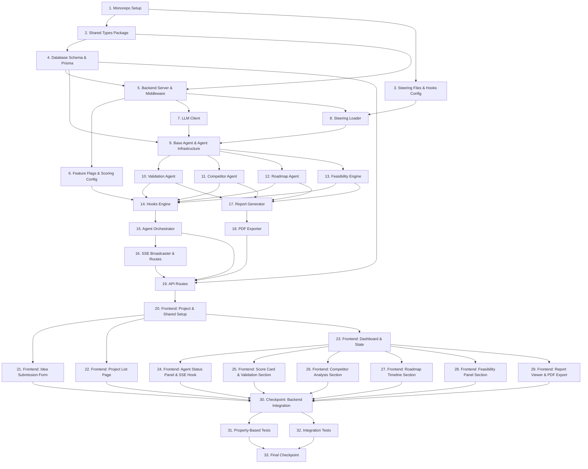

# Implementation Plan: InnovationOS

## Overview

InnovationOS is a monorepo-structured, agentic AI platform that transforms raw startup ideas into validated startup plans through a coordinated pipeline of specialized AI agents. The implementation follows a dependency-ordered sequence: shared types and infrastructure first, then the backend core (database, services, agents), then the frontend, then integration wiring, and finally tests.

All tasks implement MVP scope only. Post-MVP features (Funding Agent, Mentor Agent, Pitch Agent, AI Advisor, Authentication) are architecturally accommodated via feature flags but are not implemented.

---

## Task Dependency Graph

```json
{
  "waves": [
    { "wave": 1, "tasks": ["1", "2", "3"] },
    { "wave": 2, "tasks": ["4", "5", "6", "7", "8"] },
    { "wave": 3, "tasks": ["9"] },
    { "wave": 4, "tasks": ["10", "11", "12", "13"] },
    { "wave": 5, "tasks": ["14", "15", "16", "17"] },
    { "wave": 6, "tasks": ["18", "19"] },
    { "wave": 7, "tasks": ["20", "21", "22", "23"] },
    { "wave": 8, "tasks": ["24", "25", "26", "27", "28", "29"] },
    { "wave": 9, "tasks": ["30"] },
    { "wave": 10, "tasks": ["31", "32"] },
    { "wave": 11, "tasks": ["33"] }
  ]
}
```



---

## Tasks

- [x] 1. Monorepo Project Setup
  - Initialize root `package.json` with npm workspaces (`packages/frontend`, `packages/backend`, `packages/shared`)
  - Create root `turbo.json` with pipeline definitions for `build`, `dev`, `test`, `lint`
  - Create `packages/shared/package.json`, `packages/backend/package.json`, `packages/frontend/package.json` with exact version pins for all dependencies
  - Add root `.env.example` with all required variables: `DATABASE_PROVIDER`, `DATABASE_URL`, `GEMINI_API_KEY`, `OPENAI_COMPATIBLE_API_URL`, `FRONTEND_URL`, `FUNDING_AGENT_ENABLED`, `MENTOR_AGENT_ENABLED`, `PITCH_AGENT_ENABLED`, `AI_ADVISOR_ENABLED`, `AUTH_ENABLED`
  - Add root `.gitignore` excluding `node_modules`, `.env`, `dist`, `.next`, `*.db`
  - Set up TypeScript `tsconfig.json` at root and per-package, with strict mode and path aliases for `@innovationos/shared`
  - Install and configure ESLint + Prettier at root, shared across packages
  - _Requirements: 18.4, 21.8, 21.9_

- [x] 2. Shared Types Package (`packages/shared`)
  - [x] 2.1 Create all shared TypeScript type definitions
    - `packages/shared/src/types/agents.ts`: `AgentType`, `AgentStatus`, `AgentRunSummary` interfaces
    - `packages/shared/src/types/project.ts`: `ProjectWorkspaceSummary`, `CreateProjectDto`, `Industry` enum with all predefined values
    - `packages/shared/src/types/report.ts`: `StartupIntelligenceReportDto`, `FullReportData`
    - `packages/shared/src/types/api.ts`: `ApiResponse<T>`, `ApiError` envelope types
    - `packages/shared/src/types/hooks.ts`: `HookConfig`, `HookEvent`, `HookAction`, `HookConditions` interfaces
    - `packages/shared/src/index.ts`: barrel export of all types
    - Build the package with `tsc` and verify imports resolve from backend and frontend
    - _Requirements: 14.2, 21.9_

- [x] 3. Steering Files and Hooks Configuration
  - [x] 3.1 Create all six steering Markdown files in `.kiro/steering/`
    - `.kiro/steering/explainability.md`: Output transparency standards — every agent output must include a data source attribution note; scores must include written explanations of ≥50 words; all conclusions must reference the factors considered
    - `.kiro/steering/student-first.md`: Plain language guidelines — no unexplained jargon; context for every score; constructive framing for early-stage innovators; all feedback phrased as learning opportunities
    - `.kiro/steering/real-world-impact.md`: Criteria for grounding recommendations in actionable reality — recommendations must reference concrete, achievable actions; avoid theoretical suggestions without implementation path
    - `.kiro/steering/ethical-ai.md`: Prohibited output patterns — no discrimination based on founder's personal characteristics, region of origin, or academic background; bias mitigation guidance; outputs must be inclusive and equitable
    - `.kiro/steering/actionable-recommendations.md`: Recommendation structure standard — every recommendation must include an action verb (e.g., "Conduct", "Build", "Partner", "Validate"), a target outcome, and a next step; recommendations must be ranked by estimated impact from highest to lowest
    - `.kiro/steering/scoring-methodology.md`: Scoring rubric — define weights and factor sets for each score type; Launch Readiness Score = `round(technical × 0.25 + market × 0.30 + financial × 0.20 + innovation × 0.25)`; this file is the single source of truth for all scoring
    - _Requirements: 19.1, 19.2, 19.5, 19.6, 19.7, 19.8, 19.9_

  - [x] 3.2 Create all MVP hooks JSON config files in `.kiro/hooks/`
    - `.kiro/hooks/on-idea-submitted.json`: fires on `idea.submitted`, triggers `validation` agent, `enabled: true`
    - `.kiro/hooks/on-validation-completed.json`: fires on `agent.completed` with `agentType: validation`, triggers `competitor` agent, `enabled: true`
    - `.kiro/hooks/on-competitor-completed.json`: fires on `agent.completed` with `agentType: competitor`, triggers `roadmap` agent (and `funding`/`mentor` where feature flags enabled) in parallel, `enabled: true`
    - `.kiro/hooks/on-roadmap-completed.json`: fires on `agent.completed` with `agentType: roadmap`, action `generate_report`, `enabled: true`
    - `.kiro/hooks/on-funding-completed.json`: post-MVP stub, `enabled: false`
    - `.kiro/hooks/on-pitch-completed.json`: post-MVP stub, `enabled: false`
    - _Requirements: 20.1, 20.2, 20.3_

- [x] 4. Database Schema and Prisma Setup (`packages/backend`)
  - [x] 4.1 Create Prisma schema with all models
    - `packages/backend/prisma/schema.prisma`: configure datasource with `env("DATABASE_PROVIDER")` and `env("DATABASE_URL")` for SQLite dev / PostgreSQL prod switchability
    - Define all models: `ProjectWorkspace`, `AgentRun` (with `@@unique([projectId, agentType])`), `ValidationResult`, `ValidationRisk`, `ValidationRecommendation`, `CompetitorAnalysis`, `Competitor`, `RoadmapPhase` (with `@@unique([projectId, order])`), `Milestone`, `Deliverable`, `FeasibilityScore`, `StartupIntelligenceReport`, `ConversationHistory` (post-MVP stub)
    - All cascade delete relationships as specified in the design
    - `packages/backend/src/lib/prisma.ts`: Prisma client singleton
    - Run `npx prisma migrate dev --name init` to generate initial migration and SQLite dev database
    - _Requirements: 14.4, 14.5, 14.6, 21.3_

  - [ ]* 4.2 Write unit tests for Prisma schema integrity
    - Verify `@@unique([projectId, agentType])` constraint on `AgentRun` rejects duplicates
    - Verify cascade deletes propagate correctly from `ProjectWorkspace` to all child models
    - _Requirements: 14.5_

- [ ] 5. Backend Server, Middleware, and Logger (`packages/backend`)
  - [ ] 5.1 Create Express server entry point and middleware stack
    - `packages/backend/src/server.ts`: Express app, `express.json()`, `requestLogger`, `cors`, route mounting, `errorHandler`
    - `packages/backend/src/middleware/requestLogger.ts`: structured request/response logging (method, path, status, duration)
    - `packages/backend/src/middleware/errorHandler.ts`: catches all unhandled errors; maps `ValidationError` → 400 with `fields`, `NotFoundError` → 404, all others → 500; always returns `{ error: { message } }` envelope
    - `packages/backend/src/middleware/validateBody.ts`: higher-order middleware accepting a Zod schema, returns 400 `{ error: { message, fields } }` on failure
    - `packages/backend/src/lib/logger.ts`: structured logger (pino or equivalent)
    - Custom error classes: `ValidationError(message, fields)`, `NotFoundError(message)` in `packages/backend/src/lib/errors.ts`
    - _Requirements: 14.2, 14.3, 21.2_

  - [ ]* 5.2 Write unit tests for middleware
    - Test `errorHandler` returns correct HTTP status and JSON envelope for `ValidationError`, `NotFoundError`, and generic `Error`
    - Test `validateBody` returns 400 with field-level errors on Zod schema failure
    - _Requirements: 14.2, 14.3_

- [ ] 6. Feature Flags and Scoring Config (`packages/backend`)
  - [ ] 6.1 Implement feature flags singleton and scoring weights config
    - `packages/backend/src/config/featureFlags.ts`: `FLAGS` object loaded from environment variables for `FUNDING_AGENT_ENABLED`, `MENTOR_AGENT_ENABLED`, `PITCH_AGENT_ENABLED`, `AI_ADVISOR_ENABLED`, `AUTH_ENABLED`; export `featureFlags.isEnabled(flag)` function
    - `packages/backend/src/config/scoringWeights.ts`: export `SCORING_WEIGHTS` constant `{ technical: 0.25, market: 0.30, financial: 0.20, innovation: 0.25 }` and `computeLaunchReadiness(t, m, f, i): number` pure function
    - Add `GET /api/config/features` endpoint returning all flag states as `{ data: Record<string, boolean> }`
    - _Requirements: 15.2, 15.3, 18.6, 20.6, 21.6_

  - [ ]* 6.2 Write property test for Launch Readiness Score formula (Property 5)
    - **Property 5: Launch Readiness Score Formula Invariant**
    - **Validates: Requirements 6.5, 15.3**
    - Use `fast-check` to generate four integers in [0, 100]; assert `computeLaunchReadiness(t, m, f, i) === Math.round(t * 0.25 + m * 0.30 + f * 0.20 + i * 0.25)` and result is in [0, 100]; `numRuns: 500`
    - _Requirements: 6.5, 15.3_

- [ ] 7. LLM Client (`packages/backend`)
  - [ ] 7.1 Implement `LLMClient` with Gemini primary and OpenAI-compatible fallback
    - `packages/backend/src/services/LLMClient.ts`: `complete(systemContext: string, userPrompt: string): Promise<string>` method
    - `callGemini()`: uses `@google/generative-ai` SDK with `GEMINI_API_KEY`; sends system instruction + user prompt; requests JSON-only output via system instruction `"You must respond with valid JSON only. Do not include markdown code fences."`
    - `callOpenAICompatible()`: uses `openai` SDK pointed at `OPENAI_COMPATIBLE_API_URL`; same JSON-only system instruction
    - Fallback logic: try Gemini, catch error, if `OPENAI_COMPATIBLE_API_URL` is set try fallback, else re-throw
    - _Requirements: 21.4, 21.5, 21.6_

  - [ ]* 7.2 Write unit tests for LLMClient fallback behavior
    - Mock Gemini to throw; assert fallback is called when `OPENAI_COMPATIBLE_API_URL` is set
    - Assert original error is re-thrown when no fallback URL is configured
    - _Requirements: 21.5_

- [ ] 8. Steering Loader Service (`packages/backend`)
  - [ ] 8.1 Implement `SteeringLoader` that reads `.kiro/steering/` at agent init
    - `packages/backend/src/services/SteeringLoader.ts`: static `loadAll(): Promise<string>` method
    - Reads all `.md` files from `.kiro/steering/` directory; wraps each with `## Steering: {filename}\n{content}`; concatenates with `\n\n---\n\n` separator
    - On file read error: log warning with filename using logger and skip file (do not throw)
    - Returns concatenated string (may be empty if all files fail)
    - _Requirements: 19.1, 19.3, 19.4_

  - [ ]* 8.2 Write unit tests for SteeringLoader
    - Assert all six steering files are loaded and concatenated into a single string
    - Assert missing file logs a warning and does not throw; remaining files still loaded
    - _Requirements: 19.4_

- [ ] 9. Base Agent and Agent Infrastructure (`packages/backend`)
  - [ ] 9.1 Implement `BaseAgent` abstract class
    - `packages/backend/src/agents/BaseAgent.ts`: abstract class with `projectId`, `steeringContext`, `llmClient` properties
    - `init()`: calls `SteeringLoader.loadAll()` and stores result in `steeringContext`
    - Abstract methods: `buildPrompt(idea: IdeaData): string`, `parseOutput(raw: string): AgentOutput['data']`, `persistOutput(projectId: string, output): Promise<void>`
    - `execute(idea: IdeaData): Promise<AgentOutput>`: calls `init()`, `buildPrompt()`, `llmClient.complete(steeringContext, prompt)`, `parseOutput()`, `persistOutput()`; returns `{ agentType, data }`
    - `IdeaData` type: all `ProjectWorkspace` fields needed by agents
    - _Requirements: 2.1, 19.1_

- [ ] 10. Validation Agent (`packages/backend`)
  - [ ] 10.1 Implement `ValidationAgent` extending `BaseAgent`
    - `packages/backend/src/agents/ValidationAgent.ts`
    - `buildPrompt()`: structured JSON-requesting prompt asking for `innovationScore`, `problemClarityScore`, `marketDemandScore`, `technicalFeasibilityScore` (integers 0–100), per-score explanations (≥50 words each), `risks` array (≥3 items with `title`, `description`, `severity` ∈ {High, Medium, Low}), `recommendations` array (≥3 items with `title`, `description`, `impactRank` integer), `dataSourceAttribution` string
    - `parseOutput()`: `JSON.parse` result with Zod validation schema; on parse failure retry once with stricter prompt; throw `AgentParseError` if second attempt also fails
    - Zod schema enforces all structural constraints (score ranges 0–100, ≥3 risks, ≥3 recommendations, valid severity/category enums)
    - `persistOutput()`: write to `ValidationResult`, `ValidationRisk[]`, `ValidationRecommendation[]` using Prisma transaction; include `dataSourceAttribution`
    - Each recommendation must include action verb, target outcome, next step (enforced in prompt and Zod schema via string length)
    - _Requirements: 3.1, 3.2, 3.3, 3.4, 3.5, 3.6, 3.7, 16.1, 17.1_

  - [ ]* 10.2 Write property test for Validation Agent score range invariant (Property 4)
    - **Property 4: All Agent Score Outputs Are Valid Integers in [0, 100]**
    - **Validates: Requirements 3.1, 6.1, 6.2, 6.3, 6.4, 6.5, 15.4**
    - Mock LLM to return generated score objects; assert all four scores are integers in [0, 100]; `numRuns: 100`
    - _Requirements: 3.1, 15.4_

  - [ ]* 10.3 Write property test for Validation Agent structural completeness (Property 6 — validation portion)
    - **Property 6: Agent Output Structural Completeness (Validation)**
    - **Validates: Requirements 3.3, 3.4**
    - Use `fast-check` to generate varied idea inputs; assert output contains ≥3 risks with required fields and valid severities, ≥3 recommendations with `impactRank ≥ 1`; `numRuns: 100`
    - _Requirements: 3.3, 3.4_

- [ ] 11. Competitor Agent (`packages/backend`)
  - [ ] 11.1 Implement `CompetitorAgent` extending `BaseAgent`
    - `packages/backend/src/agents/CompetitorAgent.ts`
    - `buildPrompt()`: requests `competitors` array (≥3 with `name`, `description`, `category` ∈ {Direct, Indirect, Substitute}, optional `url`), `swot` object with `strengths[]`, `weaknesses[]`, `opportunities[]`, `threats[]` (≥2 each), `marketOpportunities[]` (≥2), `competitiveAdvantages[]` (≥2), `dataSourceAttribution`
    - `parseOutput()`: JSON.parse + Zod validation; fallback to structured extraction on parse error
    - `persistOutput()`: write to `CompetitorAnalysis` (SWOT fields stored as JSON strings) and `Competitor[]` in a Prisma transaction
    - _Requirements: 4.1, 4.2, 4.3, 4.4, 4.5, 4.6, 4.7, 16.1_

  - [ ]* 11.2 Write property test for Competitor Agent structural completeness (Property 6 — competitor portion)
    - **Property 6: Agent Output Structural Completeness (Competitor)**
    - **Validates: Requirements 4.1, 4.2, 4.3, 4.4**
    - Assert ≥3 competitors with valid categories, SWOT with ≥2 items per quadrant, ≥2 market opportunities, ≥2 competitive advantages; `numRuns: 100`
    - _Requirements: 4.1, 4.2, 4.3, 4.4_

- [ ] 12. Roadmap Agent (`packages/backend`)
  - [ ] 12.1 Implement `RoadmapAgent` extending `BaseAgent`
    - `packages/backend/src/agents/RoadmapAgent.ts`
    - `buildPrompt()`: requests `phases` array with exactly 6 entries in canonical order (Research, Validation, MVP, Testing, Launch, Growth), each with `name`, `order` (1–6), `startWeek` (≥0), `endWeek` (> startWeek), `milestones[]` (≥2 per phase, each with `title`, `description`, `priority` ∈ {High, Medium, Low}, `durationWeeks`, `deliverables[]` (≥1 per milestone with `title`, `description`))
    - `parseOutput()`: JSON.parse + Zod; Zod schema validates phase order array matches canonical sequence exactly
    - `persistOutput()`: write `RoadmapPhase[]`, `Milestone[]`, `Deliverable[]` records using nested Prisma creates
    - _Requirements: 5.1, 5.2, 5.3, 5.4, 5.5, 5.6, 5.7, 17.2_

  - [ ]* 12.2 Write property test for Roadmap phase ordering invariant (Property 7)
    - **Property 7: Roadmap Phase Ordering Invariant**
    - **Validates: Requirements 5.1**
    - Use `fast-check` to generate varied idea inputs; mock LLM; assert exactly 6 phases returned in canonical order Research→Validation→MVP→Testing→Launch→Growth with correct `order` values 1–6; `numRuns: 100`
    - _Requirements: 5.1_

  - [ ]* 12.3 Write property test for Roadmap timeline validity (Property 8)
    - **Property 8: Roadmap Phase Timeline Validity**
    - **Validates: Requirements 5.4**
    - Assert every phase has `startWeek ≥ 0` and `endWeek > startWeek`; no negative offsets or zero-duration phases; `numRuns: 100`
    - _Requirements: 5.4_

- [ ] 13. Feasibility Engine (`packages/backend`)
  - [ ] 13.1 Implement `FeasibilityEngine` extending `BaseAgent`
    - `packages/backend/src/agents/FeasibilityEngine.ts`
    - Reuse `ValidationResult.innovationScore` for `innovationScore` (no LLM recompute)
    - LLM-derive `technicalFeasibilityScore` from idea + validation outputs, `marketFeasibilityScore` from idea + competitor outputs, `financialFeasibilityScore` from idea + roadmap timeline
    - Compute `launchReadinessScore` using `computeLaunchReadiness()` from `scoringWeights.ts`
    - Generate written explanations (≥40 words each) via separate LLM call
    - `persistOutput()`: write to `FeasibilityScore` table
    - _Requirements: 6.1, 6.2, 6.3, 6.4, 6.5, 6.6, 6.7, 15.3_

  - [ ]* 13.2 Write property test for Feasibility Engine score range (Property 4 — feasibility portion)
    - **Property 4: All Agent Score Outputs Are Valid Integers in [0, 100] (Feasibility)**
    - **Validates: Requirements 6.1, 6.2, 6.3, 6.4, 6.5**
    - Assert all five feasibility scores are integers in [0, 100]; `numRuns: 100`
    - _Requirements: 6.1, 6.2, 6.3, 6.4, 6.5_

- [ ] 14. Hooks Engine Service (`packages/backend`)
  - [ ] 14.1 Implement `HooksEngine` service
    - `packages/backend/src/services/HooksEngine.ts`
    - `loadHooks()`: reads all `*.json` from `.kiro/hooks/`; validates each against the JSON schema (id, event, action.type, action.target, enabled required); logs descriptive error for malformed configs; filters to `enabled: true` hooks only
    - `dispatch(event: HookEvent): Promise<void>`: finds all matching hooks (`event.name === hook.event` AND `evaluateConditions` passes); executes each `executeHookAction`; on action failure: log with `{ hookId, event.name }` and re-throw (do NOT silently skip)
    - `evaluateConditions()`: checks `featureFlag` via `featureFlags.isEnabled()` and `agentType` match
    - `executeHookAction()`: handles `trigger_agent` (calls `Orchestrator.runAgent`) and `generate_report` (calls `ReportGenerator.generate`) action types; handles `parallel: true` for concurrent triggers
    - Call `loadHooks()` once at server startup; log descriptive error for any invalid config before serving requests
    - _Requirements: 20.1, 20.4, 20.5, 20.6, 20.7_

  - [ ]* 14.2 Write property test for Hooks Engine dispatch completeness (Property 14)
    - **Property 14: Hook Dispatch Completeness**
    - **Validates: Requirements 20.4, 20.6**
    - Use `fast-check` to generate sets of hooks with varied event names, enabled flags, and conditions; assert all matching+enabled hooks fire for a given event; assert no non-matching or disabled hook fires; `numRuns: 100`
    - _Requirements: 20.4, 20.6_

  - [ ]* 14.3 Write unit tests for HooksEngine startup validation
    - Assert server logs descriptive error for malformed hook JSON at startup (missing required field)
    - Assert well-formed but disabled hook is loaded but never fired
    - _Requirements: 20.5, 20.7_

- [ ] 15. Agent Orchestrator Service (`packages/backend`)
  - [ ] 15.1 Implement `AgentOrchestrator` service
    - `packages/backend/src/services/AgentOrchestrator.ts`
    - `runAgent(projectId: string, agentType: AgentType): Promise<void>`:
      1. Fetch `ProjectWorkspace` + `IdeaData` from DB
      2. Mark `AgentRun.status = 'running'`, set `startedAt`; broadcast `agent_status: running` via `SSEBroadcaster`
      3. Instantiate appropriate agent class; call `agent.execute(idea)`
      4. On success: persist output, mark `completed`, set `completedAt`; broadcast `agent_status: completed`; dispatch downstream hook via `HooksEngine`
      5. On error: persist `errorMessage`, mark `failed`; broadcast `agent_status: failed`; do NOT throw (non-blocking for independent agents)
    - `retryAgent(projectId, agentType)`: update existing `AgentRun` (same record, reset status to `pending`/`running`); do NOT create new `ProjectWorkspace`
    - Private `setStatus()` helper: updates `AgentRun` in DB
    - Broadcast `time_remaining` estimate every ≤10 seconds while agent is running (use `setInterval`, clear on complete/fail)
    - _Requirements: 2.1, 2.2, 2.3, 2.5, 2.6, 2.7, 2.8, 13.5_

  - [ ]* 15.2 Write property test for Initial Agent Status Invariant (Property 3)
    - **Property 3: Initial Agent Status Invariant**
    - **Validates: Requirements 1.3, 2.1**
    - For any created `ProjectWorkspace`, assert all `AgentRun` records have `status = 'pending'` immediately after creation; `numRuns: 100`
    - _Requirements: 1.3, 2.1_

  - [ ]* 15.3 Write property test for Agent Pipeline Sequential Ordering (Property 9)
    - **Property 9: Agent Pipeline Sequential Ordering**
    - **Validates: Requirements 2.1, 2.2, 2.3, 2.4, 2.7**
    - Mock agents to complete in order; assert Competitor never starts before Validation completes; Roadmap never starts before Competitor completes; Report never generated until all active agents completed; `numRuns: 100`
    - _Requirements: 2.1, 2.2, 2.3, 2.4, 2.7_

  - [ ]* 15.4 Write property test for Agent Retry Idempotence (Property 10)
    - **Property 10: Agent Retry Idempotence**
    - **Validates: Requirements 2.8**
    - For any failed agent, retrying SHALL update the existing `AgentRun` record; total `ProjectWorkspace` count SHALL be unchanged; `numRuns: 100`
    - _Requirements: 2.8_

- [ ] 16. SSE Broadcaster and SSE Route (`packages/backend`)
  - [ ] 16.1 Implement `SSEBroadcaster` service and SSE route
    - `packages/backend/src/services/SSEBroadcaster.ts`: `Map<string, Set<Response>>` of `projectId → open connections`
    - `subscribe(projectId, res)`: add to map; set SSE response headers (`Content-Type: text/event-stream`, `Cache-Control: no-cache`, `Connection: keep-alive`); call `res.flushHeaders()`
    - `unsubscribe(projectId, res)`: remove from map; clean up empty sets
    - `broadcast(projectId, eventType, data)`: write `event: {eventType}\ndata: {JSON.stringify(data)}\n\n` to all open responses for that project
    - Send `heartbeat` event every 30 seconds to keep connections alive
    - `packages/backend/src/routes/sse.ts`: `GET /api/sse/:projectId` — subscribe on request, unsubscribe on `req.on('close')`
    - _Requirements: 13.3, 13.4, 13.5_

  - [ ]* 16.2 Write unit tests for SSEBroadcaster
    - Assert broadcast delivers event to all subscribed connections for a project
    - Assert unsubscribed connection no longer receives events
    - _Requirements: 13.3_

- [ ] 17. Report Generator Service (`packages/backend`)
  - [ ] 17.1 Implement `ReportGenerator` service
    - `packages/backend/src/services/ReportGenerator.ts`
    - `generate(projectId: string): Promise<StartupIntelligenceReport>`:
      1. Fetch all agent outputs for the project from DB (ValidationResult, CompetitorAnalysis, RoadmapPhases with Milestones/Deliverables, FeasibilityScore)
      2. Compose `executiveSummary` (≤300 words) via LLM call synthesizing key findings from all agents
      3. Compose `keyRecommendations` array from Validation recommendations + Feasibility key points
      4. Persist `StartupIntelligenceReport` to DB; broadcast `report_ready` SSE event
    - All six required report sections must be non-empty: Executive Summary, Validation Summary, Competitor Analysis, Startup Roadmap, Feasibility Assessment, Key Recommendations
    - On generation failure: persist error, allow manual regeneration via `POST /api/reports/:id/regenerate`
    - _Requirements: 7.1, 7.2, 7.3, 7.4, 7.8_

  - [ ]* 17.2 Write property test for Report Completeness Invariant (Property 12)
    - **Property 12: Report Completeness Invariant**
    - **Validates: Requirements 7.2**
    - For any completed project workspace with mocked agent outputs, assert generated report contains non-empty content for all six sections; `numRuns: 100`
    - _Requirements: 7.2_

  - [ ]* 17.3 Write property test for Executive Summary Length Invariant (Property 13)
    - **Property 13: Executive Summary Length Invariant**
    - **Validates: Requirements 7.3**
    - For any generated report regardless of idea complexity, assert `executiveSummary.split(/\s+/).length ≤ 300`; `numRuns: 100`
    - _Requirements: 7.3_

- [ ] 18. PDF Exporter Service (`packages/backend`)
  - [ ] 18.1 Implement `PDFExporter` using `@react-pdf/renderer`
    - `packages/backend/src/services/PDFExporter.ts`: `exportReport(report: FullReportData): Promise<Buffer>` using `renderToBuffer`
    - `ReportDocument` component (`packages/backend/src/services/ReportDocument.tsx`): `@react-pdf/renderer` component tree
      - Cover page: project title, industry, submission date, generation timestamp
      - Executive Summary section
      - Validation Summary: score table + explanations
      - Competitor Analysis: competitor table + SWOT grid
      - Startup Roadmap: phase timeline table + milestones
      - Feasibility Assessment: score grid
      - Key Recommendations: numbered list
    - Include AI-generated disclaimer in PDF footer: "AI-generated analysis — does not constitute professional business, legal, or financial advice"
    - _Requirements: 7.6, 7.7, 22.1, 22.2, 22.3, 22.4_

  - [ ]* 18.2 Write unit tests for PDF Exporter
    - Assert `exportReport` returns a non-empty Buffer for a complete report fixture
    - Assert PDF generation completes within 15 seconds for a complete report
    - _Requirements: 22.4_

- [ ] 19. API Routes (`packages/backend`)
  - [ ] 19.1 Implement Projects routes
    - `packages/backend/src/routes/projects.ts`
    - `POST /api/projects`: validate body with `validateBody(createProjectSchema)`; create `ProjectWorkspace` + all `AgentRun` records (all agents, `status: pending`) in a Prisma transaction; dispatch `idea.submitted` hook; return 201 `{ data: project }`
    - `GET /api/projects`: return all workspaces ordered by `createdAt` descending; return 200 `{ data: ProjectWorkspace[] }`
    - `GET /api/projects/:id`: return workspace by id with agent run statuses; 404 if not found
    - `GET /api/projects/:id/agents`: return all `AgentRun` records for project
    - `GET /api/projects/:id/agents/:type`: return agent run + output; 202 if still running, 404 if not found
    - `POST /api/projects/:id/agents/:type/retry`: call `Orchestrator.retryAgent`; 202 accepted; 409 if agent currently `running`
    - _Requirements: 1.2, 1.3, 1.7, 1.8, 1.9, 1.10, 2.8, 14.1, 14.2, 14.3_

  - [ ] 19.2 Implement Reports routes
    - `packages/backend/src/routes/reports.ts`
    - `GET /api/reports/:projectId`: return report; 202 if not yet generated, 404 if project not found
    - `GET /api/reports/:projectId/export`: call `PDFExporter.exportReport`; stream buffer with `Content-Type: application/pdf` and `Content-Disposition: attachment; filename="innovationos-report-{id}.pdf"`; 202 if report not ready, 500 with error message if export fails
    - `POST /api/reports/:projectId/regenerate`: trigger `ReportGenerator.generate`; return 202 accepted
    - _Requirements: 7.4, 7.5, 7.6, 7.7, 7.8, 14.1, 22.1, 22.4_

  - [ ] 19.3 Implement Config/Features route
    - `GET /api/config/features`: return all feature flag states from `featureFlags`
    - _Requirements: 18.6_

  - [ ]* 19.4 Write property test for Idea Submission Validation Boundary Correctness (Property 1)
    - **Property 1: Idea Submission Validation Boundary Correctness**
    - **Validates: Requirements 1.1, 1.4, 1.5, 1.6**
    - Use `fast-check` to generate idea payloads at and around all boundary values (title 4/5/120/121 chars, description 49/50/2000/2001, etc.); assert valid payloads are accepted (201) and invalid payloads are rejected (400) with no false positives or negatives; `numRuns: 200`
    - _Requirements: 1.1, 1.4, 1.5, 1.6_

  - [ ]* 19.5 Write property test for Project Workspace Creation Round-Trip (Property 2)
    - **Property 2: Project Workspace Creation Round-Trip**
    - **Validates: Requirements 1.2, 1.8**
    - For any valid idea payload, assert `GET /api/projects/:id` returns all submitted fields unchanged (title, description, problemStatement, targetAudience, industry, goals); `numRuns: 100`
    - _Requirements: 1.2, 1.8_

  - [ ]* 19.6 Write property test for Project List Ordering Invariant (Property 11)
    - **Property 11: Project List Ordering Invariant**
    - **Validates: Requirements 1.9**
    - For any set of created workspaces, assert `GET /api/projects` returns them ordered by `createdAt` descending — each item's `createdAt ≥` the next item's `createdAt`; `numRuns: 100`
    - _Requirements: 1.9_

- [ ] 20. Frontend: Project Setup (`packages/frontend`)
  - [ ] 20.1 Initialize Next.js frontend package with all dependencies
    - Create `packages/frontend` with Next.js 14 App Router, TypeScript strict mode, Tailwind CSS, ShadCN UI
    - Configure `tailwind.config.ts` with design tokens (colors, typography, spacing)
    - Configure ShadCN UI: initialize with theme, add core components (Button, Input, Select, Card, Badge, Progress, Tooltip, Dialog)
    - Configure `next.config.mjs` with API proxy to backend (rewrites `/api/*` to `http://localhost:3001/api/*`)
    - `packages/frontend/src/lib/api.ts`: typed API client functions wrapping `fetch` — `createProject`, `getProject`, `listProjects`, `getAgentOutput`, `retryAgent`, `getReport`, `exportReport`, `getFeatureFlags`; all return unwrapped `data` field or throw typed `ApiError`
    - `packages/frontend/src/lib/utils.ts`: utility functions (cn for classnames, score color logic, word count, date formatting)
    - `packages/frontend/src/types/index.ts`: re-export all types from `@innovationos/shared`
    - _Requirements: 21.1, 21.9_

- [ ] 21. Frontend: Idea Submission Form
  - [ ] 21.1 Implement `IdeaSubmissionForm` component and Home page
    - `packages/frontend/src/components/forms/IdeaSubmissionForm.tsx`: controlled form with React Hook Form + Zod schema validation
    - Fields: `projectTitle` (text, 5–120 chars), `description` (textarea, 50–2000 chars), `problemStatement` (textarea, 20–1000 chars), `targetAudience` (text, 10–500 chars), `industry` (Select with predefined options), `goals` (textarea, 20–1000 chars)
    - Inline error display per field on blur and submit attempt
    - On valid submit: `POST /api/projects` → redirect to `/projects/[id]`
    - Show loading state on submit button during API call
    - AI-generated disclaimer visible in form footer
    - `packages/frontend/src/app/page.tsx`: landing page embedding `IdeaSubmissionForm`
    - _Requirements: 1.1, 1.4, 1.5, 1.6, 1.7, 16.2_

  - [ ]* 21.2 Write accessibility tests for IdeaSubmissionForm
    - Use `jest-axe` to assert no WCAG 2.1 Level AA violations
    - Assert each field has an accessible label and error message is associated via `aria-describedby`
    - _Requirements: 13.9_

- [ ] 22. Frontend: Project List Page
  - [ ] 22.1 Implement Project List page
    - `packages/frontend/src/app/projects/page.tsx`: fetches `GET /api/projects` on load; renders list of project cards
    - Each card shows: project title, industry badge, creation date (formatted), overall agent status summary (aggregated from `agentStatuses`)
    - Empty state when no projects exist
    - Each card links to `/projects/[id]`
    - "Start New Project" CTA linking to home page
    - _Requirements: 1.9, 1.10_

- [ ] 23. Frontend: Project Workspace Dashboard and State Management
  - [ ] 23.1 Implement Zustand project store and `ProjectWorkspaceDashboard` shell
    - `packages/frontend/src/hooks/useProjectStore.ts`: Zustand store with `agentStatuses: Record<AgentType, AgentStatus>`, `estimatedTimeRemaining: number | null`; actions `updateAgentStatus`, `setTimeRemaining`
    - `packages/frontend/src/app/projects/[id]/page.tsx`: React Server Component for initial data fetch; passes data to client dashboard component
    - `packages/frontend/src/components/dashboard/ProjectWorkspaceDashboard.tsx`: client component; renders project header (title, industry, submission date), `AgentStatusPanel`, tabbed/sectioned layout for all agent output panels, `ReportViewer`; subscribes to SSE on mount via `useSSE`
    - Responsive layout: functional from 375px to 1920px (use Tailwind responsive breakpoints)
    - "Coming Soon" badges for post-MVP sections (Funding, Mentors, Pitch Deck, AI Advisor) — rendered when feature flags are false
    - _Requirements: 13.1, 13.2, 13.6, 13.7, 13.8, 18.3_

- [ ] 24. Frontend: Agent Status Panel and SSE Hook
  - [ ] 24.1 Implement `useSSE` hook and `AgentStatusPanel` component
    - `packages/frontend/src/hooks/useSSE.ts`: `useEffect` opens `EventSource` for `/api/sse/:projectId` on mount; listens for `agent_status` (calls `updateAgentStatus`), `time_remaining` (calls `setTimeRemaining`), `report_ready` (triggers SWR revalidation or state update), `heartbeat` (no-op); closes connection on unmount; on reconnect re-fetches current agent statuses via `GET /api/projects/:id/agents` to sync missed events
    - `packages/frontend/src/components/dashboard/AgentStatusPanel.tsx`: renders per-agent status chips for MVP agents (Validation, Competitor, Roadmap, Feasibility) using colored badges (pending=gray, running=amber/animated, completed=green, failed=red); shows estimated time remaining for running agent (from store), updated ≤10s; post-MVP agents shown as "Coming Soon" badges
    - _Requirements: 2.5, 13.3, 13.4, 13.5, 18.3_

  - [ ]* 24.2 Write accessibility tests for AgentStatusPanel
    - Use `jest-axe` to assert no WCAG 2.1 Level AA violations in all four status states
    - _Requirements: 13.9_

- [ ] 25. Frontend: Score Card Component and Validation Section
  - [ ] 25.1 Implement `ScoreCard` component and Validation section panel
    - `packages/frontend/src/components/dashboard/ScoreCard.tsx`: accepts `score: number`, `label: string`, `explanation: string`, `methodologyNote?: string`; renders SVG radial gauge + numeric value; WCAG-compliant color scheme (green ≥70, amber 40–69, red <40); shows contextual improvement message when `score < 40`; methodology tooltip accessible via keyboard
    - Validation section in `ProjectWorkspaceDashboard`: grid of four `ScoreCard` components (Innovation, Problem Clarity, Market Demand, Technical Feasibility); collapsible risks list (each with severity badge colored by level — red=High, amber=Medium, green=Low); recommendations list ordered by `impactRank`; AI-generated disclaimer
    - Data source attribution note displayed per agent section
    - _Requirements: 3.8, 3.9, 3.10, 15.4, 15.5, 16.1, 16.2, 16.4, 16.5_

  - [ ]* 25.2 Write accessibility tests for ScoreCard
    - Use `jest-axe` to assert no WCAG 2.1 Level AA violations across all score ranges (0, 39, 40, 69, 70, 100)
    - Assert contextual improvement message renders and is accessible when score < 40
    - _Requirements: 13.9, 16.5_

- [ ] 26. Frontend: Competitor Analysis Section
  - [ ] 26.1 Implement `CompetitorTable` component and Competitor Analysis section panel
    - `packages/frontend/src/components/dashboard/CompetitorTable.tsx`: sortable table of competitors with category badges (Direct/Indirect/Substitute); each row shows name, description, category, URL link (if available); collapsible SWOT quadrant cards (Strengths, Weaknesses, Opportunities, Threats) below the table; market opportunities list; competitive advantages list
    - AI-generated disclaimer; data source attribution note
    - _Requirements: 4.8, 16.1, 16.2_

- [ ] 27. Frontend: Roadmap Timeline Section
  - [ ] 27.1 Implement `RoadmapTimeline` component and Roadmap section panel
    - `packages/frontend/src/components/dashboard/RoadmapTimeline.tsx`: phased Gantt-style timeline; horizontal bars representing `startWeek` to `endWeek` for each phase; expandable phase rows showing phase name, estimated timeline, milestones (with priority badges), deliverables under each milestone; phases displayed in canonical order (Research → Growth)
    - _Requirements: 5.8, 5.9_

- [ ] 28. Frontend: Feasibility Panel Section
  - [ ] 28.1 Implement `FeasibilityPanel` component and Feasibility section panel
    - `packages/frontend/src/components/dashboard/FeasibilityPanel.tsx`: grid of `ScoreCard` components for Technical, Market, Financial, Innovation dimensions; `LaunchReadinessScore` displayed prominently as primary indicator (larger ScoreCard or hero metric); explanations shown beneath each score; methodology note linking to `scoring-methodology.md` description
    - _Requirements: 6.8, 6.9, 13.2_

  - [ ]* 28.2 Write accessibility tests for FeasibilityPanel
    - Use `jest-axe` to assert no WCAG 2.1 Level AA violations
    - _Requirements: 13.9_

- [ ] 29. Frontend: Report Viewer and PDF Export
  - [ ] 29.1 Implement `ReportViewer` component and Report section panel
    - `packages/frontend/src/components/dashboard/ReportViewer.tsx`: renders full `StartupIntelligenceReport` in structured sections (Executive Summary, Validation Summary, Competitor Analysis, Startup Roadmap, Feasibility Assessment, Key Recommendations); prominent "Export PDF" button triggers `GET /api/reports/:id/export`; shows download progress indicator during generation; handles 202 (report not yet ready) by polling or showing queued state; AI disclaimer in report footer
    - Prominent CTA surfaces on dashboard when report is ready (from `report_ready` SSE event or SSE store)
    - Handle export failure: display descriptive error message; report data remains intact
    - _Requirements: 7.5, 7.6, 7.7, 7.8, 13.7, 22.1, 22.2, 22.3, 22.5_

- [ ] 30. Checkpoint: Full Stack Integration Smoke Test
  - Wire all backend services together: verify `server.ts` mounts all routes; HooksEngine loads on startup; Prisma client initializes correctly; SSEBroadcaster singleton is shared between orchestrator and routes
  - Verify frontend API client calls reach backend routes (CORS configured, proxy working)
  - Submit a test idea end-to-end (with agents mocked to return fixture data) and confirm: workspace created → all AgentRuns pending → validation agent runs → competitor runs → roadmap runs → feasibility runs → report generated → SSE events delivered to frontend → dashboard updates
  - Confirm all "Coming Soon" badges appear for disabled post-MVP features
  - Ensure all tests pass, ask the user if questions arise.
  - _Requirements: 18.4, 18.5_

- [ ] 31. Property-Based Tests (fast-check)

  > All property tests use `fast-check` with minimum 100 iterations (`numRuns: 100`), or 500 for high-value properties. Each test file is tagged with `// Feature: innovation-os, Property N: <title>`.

  - [ ]* 31.1 Property 1 — Idea Submission Validation Boundary Correctness (`packages/backend/src/routes/__tests__/projects.test.ts`)
    - Already specified in task 19.4 — confirm test exists and passes
    - **Validates: Requirements 1.1, 1.4, 1.5, 1.6**

  - [ ]* 31.2 Property 2 — Project Workspace Creation Round-Trip (`packages/backend/src/routes/__tests__/projects.test.ts`)
    - Already specified in task 19.5 — confirm test exists and passes
    - **Validates: Requirements 1.2, 1.8**

  - [ ]* 31.3 Property 3 — Initial Agent Status Invariant (`packages/backend/src/services/__tests__/AgentOrchestrator.test.ts`)
    - Already specified in task 15.2 — confirm test exists and passes
    - **Validates: Requirements 1.3, 2.1**

  - [ ]* 31.4 Property 4 — All Agent Score Outputs Are Valid Integers in [0, 100]
    - Covers `ValidationAgent.test.ts` (task 10.2), `FeasibilityEngine.test.ts` (task 13.2) — confirm all score-range tests pass
    - **Validates: Requirements 3.1, 6.1–6.5, 15.4**

  - [ ]* 31.5 Property 5 — Launch Readiness Score Formula Invariant (`packages/backend/src/lib/__tests__/scoring.test.ts`)
    - Already specified in task 6.2 — confirm test passes with `numRuns: 500`
    - **Validates: Requirements 6.5, 15.3**

  - [ ]* 31.6 Property 6 — Agent Output Structural Completeness
    - Covers `ValidationAgent.test.ts` (task 10.3) and `CompetitorAgent.test.ts` (task 11.2) — confirm all structural completeness tests pass
    - **Validates: Requirements 3.3, 3.4, 4.1–4.4, 5.2, 5.3**

  - [ ]* 31.7 Property 7 — Roadmap Phase Ordering Invariant (`packages/backend/src/agents/__tests__/RoadmapAgent.test.ts`)
    - Already specified in task 12.2 — confirm test exists and passes
    - **Validates: Requirements 5.1**

  - [ ]* 31.8 Property 8 — Roadmap Phase Timeline Validity (`packages/backend/src/agents/__tests__/RoadmapAgent.test.ts`)
    - Already specified in task 12.3 — confirm test exists and passes
    - **Validates: Requirements 5.4**

  - [ ]* 31.9 Property 9 — Agent Pipeline Sequential Ordering (`packages/backend/src/services/__tests__/AgentOrchestrator.test.ts`)
    - Already specified in task 15.3 — confirm test exists and passes
    - **Validates: Requirements 2.1–2.4, 2.7**

  - [ ]* 31.10 Property 10 — Agent Retry Idempotence (`packages/backend/src/services/__tests__/AgentOrchestrator.test.ts`)
    - Already specified in task 15.4 — confirm test exists and passes
    - **Validates: Requirements 2.8**

  - [ ]* 31.11 Property 11 — Project List Ordering Invariant (`packages/backend/src/routes/__tests__/projects.test.ts`)
    - Already specified in task 19.6 — confirm test exists and passes
    - **Validates: Requirements 1.9**

  - [ ]* 31.12 Property 12 — Report Completeness Invariant (`packages/backend/src/services/__tests__/ReportGenerator.test.ts`)
    - Already specified in task 17.2 — confirm test exists and passes
    - **Validates: Requirements 7.2**

  - [ ]* 31.13 Property 13 — Executive Summary Length Invariant (`packages/backend/src/services/__tests__/ReportGenerator.test.ts`)
    - Already specified in task 17.3 — confirm test exists and passes
    - **Validates: Requirements 7.3**

  - [ ]* 31.14 Property 14 — Hook Dispatch Completeness (`packages/backend/src/services/__tests__/HooksEngine.test.ts`)
    - Already specified in task 14.2 — confirm test exists and passes
    - **Validates: Requirements 20.4, 20.6**

- [ ] 32. Integration Tests
  - [ ]* 32.1 Full idea submission → workspace created → all AgentRuns pending (Prisma + SQLite test DB)
    - `POST /api/projects` with valid payload; assert 201 response; assert `ProjectWorkspace` in DB with all fields; assert all `AgentRun` records created with `status = 'pending'`
    - _Requirements: 1.2, 1.3, 1.8_

  - [ ]* 32.2 Full agent pipeline mock execution (validation → competitor → roadmap → feasibility → report)
    - Agents mocked to return fixture outputs; assert pipeline fires in correct order via hook dispatch; assert `StartupIntelligenceReport` created; assert `report_ready` SSE event delivered
    - _Requirements: 2.1, 2.2, 2.3, 2.4, 7.1_

  - [ ]* 32.3 PDF export endpoint returns correct headers and non-empty buffer
    - `GET /api/reports/:projectId/export` with a complete fixture report; assert `Content-Type: application/pdf`, `Content-Disposition: attachment`, non-empty response body
    - _Requirements: 7.6, 22.1, 22.4_

  - [ ]* 32.4 SSE endpoint delivers `agent_status` events during mocked agent run
    - Connect EventSource to `/api/sse/:projectId`; trigger mocked agent run; assert `agent_status` event with `running` then `completed` is received
    - _Requirements: 13.3, 13.4_

  - [ ]* 32.5 Retry endpoint updates existing AgentRun, does not create new workspace
    - Create workspace; mock agent to fail; call `POST .../retry`; assert same `AgentRun` record updated; assert `ProjectWorkspace` count unchanged
    - _Requirements: 2.8_

  - [ ]* 32.6 Playwright responsive layout tests
    - At breakpoints 375, 768, 1024, 1440, 1920px: assert `ProjectWorkspaceDashboard` renders without horizontal overflow and all sections are accessible
    - _Requirements: 13.8_

- [ ] 33. Final Checkpoint
  - Run full test suite: `npm run test` from monorepo root
  - Verify all property tests pass (14 properties, all `numRuns` thresholds met)
  - Verify all integration tests pass against SQLite test database
  - Verify frontend builds without TypeScript errors: `npm run build` in `packages/frontend`
  - Verify backend builds without errors: `npm run build` in `packages/backend`
  - Verify app starts with `npm run dev` and full pipeline completes for a test idea submission
  - Ensure all tests pass, ask the user if questions arise.

---

## Notes

- Tasks marked with `*` are optional test sub-tasks and can be skipped for a faster MVP build — core behavior is still implemented without them.
- Each task references specific requirement numbers for full traceability to `requirements.md`.
- All 14 correctness properties from `design.md` are covered by property-based tests, co-located with their implementation tasks and consolidated in Task 31.
- Post-MVP features (Funding Agent, Mentor Agent, Pitch Agent, AI Advisor, Authentication) are accommodated via feature flags and hook config stubs — no implementation required.
- The `packages/shared` package must be built before `packages/backend` or `packages/frontend` to ensure type imports resolve correctly.
- Prisma migrations must be run before any backend tests that interact with the database.
- All LLM calls in tests must be mocked to avoid real API costs and non-determinism.
